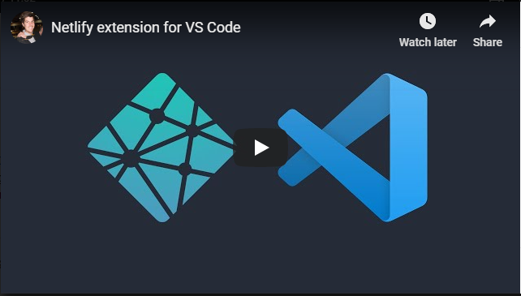

# Netlify for VS Code

**Unofficial Netlify extension for VS Code.**

 

> **Update** 🎉: Using SecretStorage API to store the Netlify API Token for security purposes.

## Features

* ✅ Deploy status and errors inside VS Code.
* 🌍 View latest production build with single click.
* 👀 Deploy preview straight from branch in VS Code.
* ⚡️ VS Code command palette integration.
* 👓 Netlify sidebar for in-depth deploy information

## Documentation

- [Netlify for VS Code](#netlify-for-vs-code)
  - [Features](#features)
  - [Documentation](#documentation)
    - [Video Overview](#video-overview)
    - [Status bar](#status-bar)
    - [Command palette](#command-palette)
    - [Settings](#settings)
      - [*netlify.site_id*](#netlifysiteid)
      - [*netlify.set_interval*](#netlifysetinterval)
      - [*netlify.build_hook*](#netlifybuildhook)
      - [*netlify.build_status_colors*](#netlifybuildstatuscolors)
    - [Feedback](#feedback)

### Video Overview

[](https://www.youtube.com/watch?v=N91S5UsT0Ng)


### Status bar

The deployment monitor in the VS Code status bar should show one of the following states:

* *Site is being deployed*
* *Site deploy was successful*
* *Site is waiting to be built*
* *Site deploy has failed*

### Command palette

You can run the following commands from the VS Code command palette:

* `Netlify: View Latest Deploy` - Opens the latest deploy of your branch in the browser
* `Netlify: View Production Site` - Opens the production site in the browser
* `Netlify: Trigger Netlify Build` - Triggers a build using the provided Netlify Build Hook
* `Netlify: View Deploy Log` - Opens the Deploy Log on Netlify for the current branch in the browser
* `Netlify: Set Netlify API Token` - Uses SecretStorage API 🔐

### Settings

You can configure the extension straight from VS Code settings, by simply searching for `Netlify`. However, should you wish, you can also configure it straight from the `settings.json` file as follows:


```json
{
  "netlify.site_id": "<site_name|api_id>",
  "netlify.set_interval": "<number>",
  "netlify.build_status_colors": {
    "building": "<hex|name>",
    "enqueued": "<hex|name>",
    "deploy-successful": "<hex|name>",
    "error": "<hex|name>"
  }
}
```

These values are as follows:

#### *netlify.site_id*

The name of your site or api id can be used, you can find these details under **Site detail**. If you site name is `my-site` then you need to append `.netlify.com` so it will be `my-site.netlify.com`

#### *netlify.set_interval*

The default is 10000ms but you can set whatever polling interval you would like.

#### *netlify.build_hook*

This is your build hook endpoint for triggering a build process, you can create one via *Build & deploy* which can be found in a project's *Settings*

You can trigger the build hook straight from VS Code via the command palette `Netlify: Trigger Build`

#### *netlify.build_status_colors*

You can set the colors of the Netlify build status, makes it a bit easier is if the default colors do not play nicely with your theme. Here is the config for it via the `settings.json`

```json
"netlify.build_status_colors": {
  "building": "<hex|name>",
  "enqueued": "<hex|name>",
  "deploy-successful": "<hex|name>",
  "error": "<hex|name>"
}
```

If you don't set a property with a color then it will just default to the internal color for that property

### Feedback

If you love using this VS Code extension, please leave some feedback or rate it on the [VS Code Marketplace](https://marketplace.visualstudio.com/items?itemName=shailen.netlify) it would be greatly appreciated. 

If you have any ideas on how we can improve this project or maybe you found a bug, please let us know via a Github Issue.